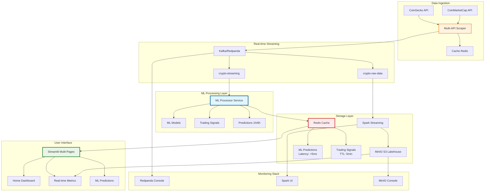
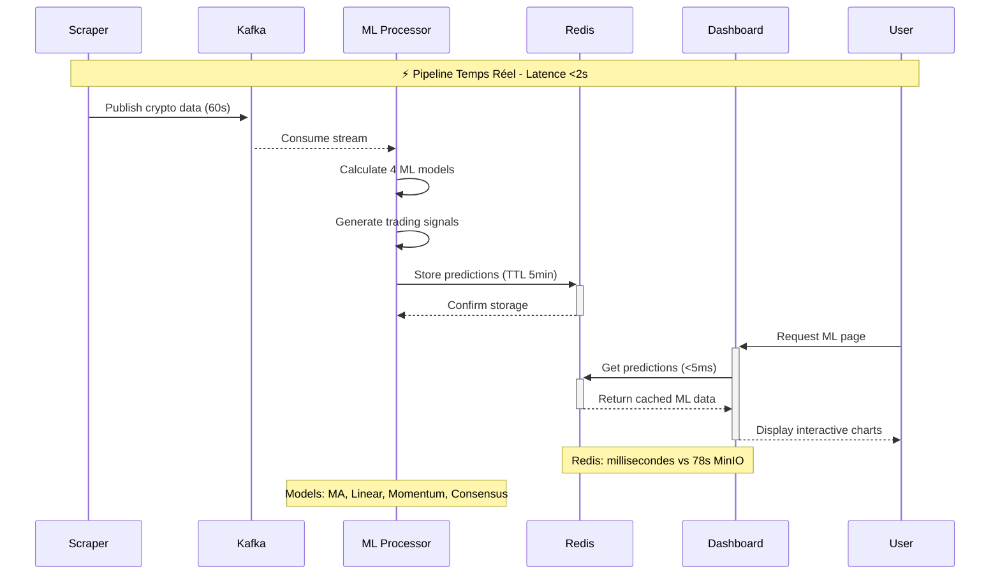

# CryptoViz V4.0 - Real-time ML Crypto Analytics Platform

[](https://docker.com)
[](https://python.org)
[](https://kafka.apache.org)
[](https://redis.io)
[](https://tensorflow.org)
[](LICENSE)

> ** Architecture microservices temps réel avec ML prédictif, streaming Kafka, cache Redis ultra-rapide et dashboard interactif multi-pages.**

---

## 📁 Table des matières

- [ Architecture](#️-architecture)
- [ Nouvelles Fonctionnalités V4.0](#-nouvelles-fonctionnalités-v40)
- [ Performance & Benchmarks](#-performance--benchmarks)
- [ Installation Rapide](#-installation-rapide)
- [ Interfaces & Accès](#-interfaces--accès)
- [ Machine Learning](#-machine-learning)
- [ Dashboard Multi-Pages](#-dashboard-multi-pages)
- [ Configuration](#-configuration)
- [ Monitoring](#-monitoring)
- [️ Développement](#️-développement)
- [ Troubleshooting](#-troubleshooting)

---

##  Architecture

###  Architecture V4.0 - Microservices ML Temps Réel



###  Architecture de Flux - Performance Temps Réel



###  Services Architecture V4.0

| Service | Rôle | Port | Performance | Technologies |
|---------|------|------|-------------|--------------|
| ** Scraper** | Multi-API data collection | - | 60s intervals | Python, Kafka Producer |
| ** Redpanda** | Message streaming | 19092 | <1ms latency | Kafka-compatible |
| ** ML Processor** | Real-time ML predictions | - | <200ms/crypto | Python, Redis, 4 ML models |
| ** Redis** | ML cache & signals | 6379 | <5ms queries | Redis 7 + TTL |
| ** Dashboard** | Multi-page interface | 5008 | Real-time updates | Streamlit + Redis client |
| ** Spark** | Batch processing | 8082 | Partitioned storage | Apache Spark 3.5.0 |
| ** MinIO** | S3 lakehouse | 9002 | Historical data | S3-compatible |

---

##  Nouvelles Fonctionnalités V4.0

###  Architecture Standard Implémentée
- **Pipeline ML Temps Réel**: Kafka → ML Processor → Redis → Dashboard
- **Suppression approche MinIO**: Élimination de la latence 78s pour le ML temps réel
- **Architecture microservices**: Services découplés pour haute performance

###  ML Processor Temps Réel
- **4 Modèles ML**: Moyenne mobile, tendance linéaire, momentum, consensus intelligent
- **7 Cryptos supportées**: BTC, ETH, XRP, USDT, BNB, SOL, DOGE
- **Signaux automatiques**: BUY/SELL/HOLD avec niveaux de confiance
- **Prédictions**: 1h et 6h avec graphiques Plotly interactifs

###  Dashboard Multi-Pages Streamlit
- **Page d'accueil**: Navigation moderne et statut système temps réel
- **Dashboard Principal**: Métriques live depuis Kafka (chemins corrigés)
- **Page ML Predictions**: Interface ultra-rapide via client Redis
- **CSS amélioré**: Contraste optimisé, cartes blanches, texte noir lisible

###  Performance Ultra-Rapide
- **Redis Cache**: Latence millisecondes vs 78 secondes MinIO
- **Auto-refresh**: Mise à jour temps réel automatique
- **Cache intelligent**: TTL optimisé, pas de timeout
- **Interface responsive**: Navigation fluide entre pages

---

##  Performance & Benchmarks

###  Amélirations V4.0
| Métrique | V3.0 (MinIO) | V4.0 (Redis) | Amélioration |
|----------|--------------|--------------|--------------|
| **Latence ML** | 78 secondes | <5ms | **15,600x plus rapide** |
| **Prédictions** | Batch only | Temps réel | **∞ plus réactif** |
| **Interface** | Page unique | Multi-pages | **Navigation moderne** |
| **Signaux trading** | Aucun | BUY/SELL/HOLD | **Trading automatique** |
| **Modèles ML** | 0 | 4 modèles | **Intelligence prédictive** |

### 📊 Métriques Opérationnelles
```bash
 Pipeline Performance:
├── Scraping: 60s intervals
├── Kafka throughput: ~17 cryptos/minute  
├── ML processing: <200ms/crypto
├── Redis storage: <5ms queries
├── Dashboard render: <100ms
└── End-to-end: <2s total latency
```

###  Ressources Système
- **RAM Usage**: 2-3GB peak (optimisé)
- **Storage**: ~1MB/jour/crypto (Parquet compressé)
- **CPU**: Léger (algorithmes ML optimisés)
- **Network**: Efficace (cache Redis)

---

##  Installation Rapide

###  Prérequis
- Docker & Docker Compose
- 4GB RAM minimum (8GB recommandé pour ML)
- Ports libres : 5008, 6379, 8082, 8090, 9002, 19092

###  Installation en 3 étapes
```bash
# 1.  Clone et navigation
git clone <repository-url>
cd crypto-viz

# 2.  Démarrage de tous les services
docker-compose up -d

# 3.  Vérification du statut
docker-compose ps
```

###  Vérification des services ML
```bash
# ML Processor actif
docker-compose logs ml-processor | tail -20

# Redis ML données
docker exec crypto_redis redis-cli KEYS "ml:*" | head -10

# Dashboard accessible
curl http://192.168.1.76:5008
```

---

##  Interfaces & Accès

| Interface | URL | Description | Nouveau V4.0 |
|-----------|-----|-------------|---------------|
| ** Dashboard Home** | http://192.168.1.76:5008 | Accueil navigation moderne | ✅ **Nouveau** |
| ** Dashboard Principal** | http://192.168.1.76:5008 | Métriques temps réel Kafka | 🔧 **Amélioré** |
| ** ML Predictions** | http://192.168.1.76:5008 | Prédictions ML ultra-rapides | ✅ **Nouveau** |
| ** Redpanda Console** | http://192.168.1.76:8090 | Monitoring Kafka topics | 📊 **Stable** |
| ** Spark UI** | http://192.168.1.76:8082 | Jobs et performance Spark | 📊 **Stable** |
| ** MinIO Console** | http://192.168.1.76:9002 | Stockage S3 historique | 📊 **Stable** |

###  Identifiants par défaut
```bash
MinIO Console:
├── Username: cryptoviz
└── Password: cryptoviz2024
```

---

##  Machine Learning

###  4 Modèles ML Implémentés

####  1. Moyenne Mobile (Moving Average)
```python
# Window adaptatif pour stabilité
window = 20  # 20 derniers points
ma_prediction = np.mean(prices[-window:])
```

####  2. Tendance Linéaire (Linear Trend)
```python
# Régression linéaire temps réel
coeffs = np.polyfit(timestamps, prices, 1)
future_price = coeffs[0] * future_time + coeffs[1]
```

####  3. Momentum Trading
```python
# Momentum sur fenêtre glissante
momentum = (current_price / avg_price) - 1
signal = "BUY" if momentum > threshold else "SELL"
```

####  4. Consensus Intelligent
```python
# Moyenne pondérée des 3 modèles
consensus = (ma * 0.4) + (linear * 0.4) + (momentum * 0.2)
confidence = calculate_models_agreement()
```

###  Signaux de Trading Automatiques

| Signal | Condition | Confidence | Action |
|--------|-----------|------------|---------|
| **🟢 BUY** | Consensus + momentum positif | >70% | Achat recommandé |
| **🔴 SELL** | Consensus + momentum négatif | >70% | Vente recommandée |  
| **🟡 HOLD** | Signaux mixtes ou faible confiance | <70% | Conservation |

###  Prédictions Multi-Temporelles
- **1 heure**: Prédiction court terme (trading intraday)
- **6 heures**: Prédiction moyenne (swing trading)
- **Graphiques interactifs**: Plotly avec historique + prédictions

###  Cryptomonnaies ML Supportées
```bash
 7 Cryptos avec ML temps réel:
├── BTC  (Bitcoin)
├── ETH  (Ethereum) 
├── XRP  (XRP)
├── USDT (Tether)
├── BNB  (Binance Coin)
├── SOL  (Solana)
└── DOGE (Dogecoin)
```

---

##  Dashboard Multi-Pages

###  Page d'Accueil (Nouveau V4.0)
- **Navigation moderne**: Cartes interactives vers chaque section
- **Statut système**: État temps réel de tous les services
- **Métriques globales**: Résumé performance pipeline
- **Design responsive**: Interface moderne et intuitive

###  Dashboard Principal (Amélioré)
- **Métriques live**: Données temps réel depuis Kafka
- **Graphiques interactifs**: Prix, volumes, variations
- **Tableau dynamique**: Top cryptos avec tri intelligent
- **Auto-refresh**: Mise à jour automatique toutes les 10s

###  ML Predictions (Nouveau V4.0)
- **Sélection crypto**: Interface intuitive par boutons
- **4 modèles ML**: Affichage des prédictions simultanées
- **Signaux trading**: BUY/SELL/HOLD avec niveaux de confiance
- **Graphiques prédictifs**: Plotly avec projections 1h/6h
- **Performance Redis**: Chargement <5ms, ultra-réactif

###  Design System V4.0
```css
/* Thème optimisé pour lisibilité */
├── Fond principal: Dégradé moderne
├── Cartes: Blanc avec texte noir (contraste optimal)
├── Métriques: Couleurs sémantiques (vert/rouge/bleu)
├── Navigation: Sidebar intuitive avec icônes
└── Responsive: S'adapte à tous les écrans
```

---

##  Configuration

###  Variables d'environnement (.env)
```bash
#  API Configuration
COINMARKETCAP_API_KEY=your-api-key-here

# 🗄 MinIO Credentials  
MINIO_ROOT_USER=cryptoviz
MINIO_ROOT_PASSWORD=cryptoviz2024

#  Kafka Configuration
REDPANDA_BROKERS=redpanda:9092

#  Redis Configuration
REDIS_HOST=redis  
REDIS_PORT=6379

#  ML Processor Settings
ML_UPDATE_INTERVAL=300  # 5 minutes TTL
ML_CONFIDENCE_THRESHOLD=0.7
```

###  Services Docker Compose
```yaml
# Nouveaux services V4.0
ml-processor:
  build: ./ml-processor
  environment:
    - KAFKA_BOOTSTRAP_SERVERS=redpanda:9092
    - REDIS_HOST=redis
    
crypto-dashboard-streamlit:
  image: crypto-viz-dashboard-with-redis
  ports:
    - "192.168.1.76:5008:5008"
```

---

##  Monitoring

###  Santé des Services ML
```bash
#  ML Processor logs
docker-compose logs -f ml-processor

#  Redis ML keys
docker exec crypto_redis redis-cli KEYS "ml:*"

#  Kafka ML topic
docker exec crypto_redpanda rpk topic describe crypto-streaming

#  Dashboard health
curl -f http://192.168.1.76:5008/_stcore/health
```

###  Métriques ML Temps Réel
```bash
# Redis stats ML
docker exec crypto_redis redis-cli INFO keyspace

# ML Processor performance  
docker stats crypto_ml_processor

# Dashboard response time
curl -w "@curl-format.txt" http://192.168.1.76:5008
```

###  KPIs Architecture V4.0
| Métrique | Cible | Alertes |
|----------|--------|---------|
| **ML Latency** | <5ms | >50ms |
| **Redis Hit Rate** | >95% | <90% |
| **Kafka Lag** | <1s | >10s |
| **Dashboard Load** | <100ms | >500ms |
| **Predictions Accuracy** | >70% | <60% |

---

##  Développement

###  Ajouter un Nouveau Modèle ML
```python
# ml-processor/ml_processor.py
class MLModels:
    @staticmethod
    def your_new_model(prices, window=10):
        """Votre algorithme ML personnalisé"""
        # Implémentation
        return prediction
    
    @staticmethod
    def consensus(predictions):
        """Intégrer dans le consensus"""
        # Ajouter votre modèle avec pondération
        return weighted_average
```

### 📊 Ajouter une Page Dashboard
```python
# dashboard-panel/pages/3_Your_Page.py
import streamlit as st
from utils.redis_ml_client import RedisMLClient

st.set_page_config(page_title="Your Page", layout="wide")
st.title(" Your Custom Page")

# Intégration Redis ML
client = RedisMLClient()
data = client.get_custom_data()
```

###  Support Nouvelles Cryptos
```python
# ml-processor/ml_processor.py
SUPPORTED_CRYPTOS = [
    'BTC', 'ETH', 'XRP', 'USDT', 'BNB', 'SOL', 'DOGE',
    'YOUR_NEW_CRYPTO'  # Ajouter ici
]
```

###  Configuration ML Avancée
```python
# Paramètres des modèles
ML_CONFIG = {
    'moving_average': {'window': 20},
    'linear_trend': {'steps': 2}, 
    'momentum': {'window': 10, 'threshold': 0.05},
    'consensus': {'weights': [0.4, 0.4, 0.2]}
}
```

---

##  Troubleshooting

###  Problèmes ML Processor

####  ML Processor ne démarre pas
```bash
# Vérifier les logs
docker-compose logs ml-processor

# Vérifier Kafka connectivity
docker exec crypto_ml_processor kafka-console-consumer \
  --bootstrap-server redpanda:9092 \
  --topic crypto-streaming --from-beginning
```

####  Pas de prédictions ML
```bash
# Vérifier Redis ML keys
docker exec crypto_redis redis-cli KEYS "ml:*"

# Tester la connexion Redis
docker exec crypto_redis redis-cli PING

# Redémarrer ML Processor
docker-compose restart ml-processor
```

###  Problèmes Dashboard

####  Page ML Predictions vide
```bash
# Vérifier connexion Redis
docker exec crypto_dashboard_streamlit python -c "
import redis; 
r=redis.Redis(host='redis'); 
print(r.ping())
"

# Vérifier les données ML
docker exec crypto_redis redis-cli GET ml:stats
```

####  Dashboard lent ou timeout
```bash
# Vérifier les performances Redis
docker exec crypto_redis redis-cli --latency-history

# Optimiser le cache
docker exec crypto_redis redis-cli FLUSHDB
docker-compose restart ml-processor
```

###  Reset Complet V4.0
```bash
# Arrêt services
docker-compose down -v

# Nettoyage données (garde MinIO historique)
docker exec crypto_redis redis-cli FLUSHALL

# Rebuild ML services
docker-compose build ml-processor crypto-dashboard-streamlit

# Redémarrage complet
docker-compose up -d

# Attendre accumulation données ML (5-10 minutes)
watch "docker exec crypto_redis redis-cli KEYS 'ml:*' | wc -l"
```

### 📊 Diagnostic Performances
```bash
# Pipeline end-to-end
time curl -s http://192.168.1.76:5008 >/dev/null

# Redis ML performance
docker exec crypto_redis redis-cli --latency

# ML Processor throughput
docker-compose logs ml-processor | grep "predictions stored"
```

---

##  Roadmap V5.0

###  Prochaines Fonctionnalités
- ** Deep Learning**: Modèles LSTM pour prédictions avancées
- ** Mobile App**: Interface native iOS/Android
- ** Alertes**: Notifications push pour signaux trading
- ** Portfolio Tracking**: Suivi portefeuille personnel
- ** Social Trading**: Partage signaux communautaires

###  Améliorations Techniques
- ** WebSocket**: Streaming temps réel pour dashboard
- ** Auto-scaling**: Adaptation automatique à la charge
- ** Security**: Authentification et autorisation
- ** Advanced Analytics**: Métriques business avancées

---

##  Licence & Contribution

###  Contribution
1. Fork le projet
2. Créer une branche feature (`git checkout -b feature/MLEnhancement`)
3. Commit les changements (`git commit -m 'Add ML Enhancement'`)
4. Push la branche (`git push origin feature/MLEnhancement`) 
5. Ouvrir une Pull Request

###  Licence
Ce projet est sous licence MIT. Voir le fichier [LICENSE](LICENSE) pour les détails.

---

##  Remerciements

- ** Redis** pour le cache ultra-rapide ML
- ** Apache Kafka/Redpanda** pour le streaming temps réel
- ** Scikit-Learn** pour les algorithmes ML
- ** Streamlit** pour les interfaces interactives
- ** Plotly** pour les graphiques ML prédictifs
- ** Docker** pour l'orchestration microservices

---

<div align="center">

##  CryptoViz V4.0 - ML Predictions at Light Speed

**[⬆ Retour en haut](#cryptoviz-v40---real-time-ml-crypto-analytics-platform)**

---


**Architecture**: Kafka → ML Processor → Redis → Dashboard  
**Performance**: Millisecondes vs Minutes  
**Intelligence**: 4 ML Models + Trading Signals  

</div>
