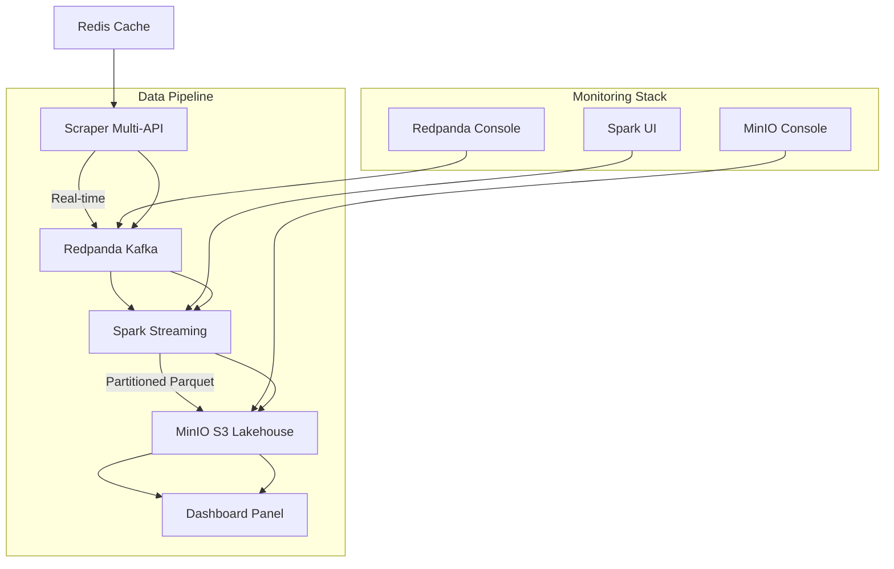

# CryptoViz V3.0 - Real-time Crypto Data Lakehouse

[](https://docker.com)
[](https://python.org)
[](https://spark.apache.org)
[](LICENSE)

> **Pipeline temps réel de données crypto avec architecture data lakehouse moderne, partitioning optimisé et interfaces de monitoring avancées.**

---

## 📁 Table des matières

- [Architecture](#architecture)
- [Fonctionnalités](#fonctionnalités)
- [Installation](#installation)
- [⚙️ Configuration](#️-configuration)
- [Utilisation](#utilisation)
- [🔗 Accès aux interfaces](#-accès-aux-interfaces)
- [Monitoring](#monitoring)
- [Développement](#développement)
- [Troubleshooting](#troubleshooting)

---

## Architecture

### Vue d'ensemble


### Services Architecture

| Service | Rôle | Port | Technologies |
|---------|------|------|--------------|
| **Scraper** | Collecte données APIs crypto | - | Python, Kafka Producer |
| **Redpanda** | Message streaming | 19092 | Kafka-compatible |
| **Spark Master/Worker** | Distributed processing | 8082 | Apache Spark 3.5.0 |
| **MinIO** | Object storage (S3) | 9002 | S3-compatible storage |
| **Dashboard** | Web interface | 5006 | Panel/Bokeh |
| **Redis** | Cache & metadata | 6379 | Redis 7 |

---

## Fonctionnalités

### Pipeline Temps Réel
- **Scraping multi-sources** : CoinMarketCap + CoinGecko
- **17 cryptomonnaies** : BTC, ETH, BNB, XRP, ADA, SOL, DOT, MATIC, AVAX, etc.
- **Fréquence** : Mise à jour toutes les 60 secondes
- **Résilience** : Auto-retry, fallback providers

### Data Lakehouse Moderne
- **Partitioning intelligent** : Structure année/mois/jour
- **Format Parquet** : Compression Snappy optimisée
- **Stockage S3** : MinIO haute performance
- **Schéma unifié** : Normalisation multi-sources

### Interface de Monitoring
- **Dashboard temps réel** : Métriques live des cryptos
- **Graphiques interactifs** : Évolution des prix, volumes
- **Tableau de données** : Historique détaillé
- **Statistiques** : Résumés automatiques

### Administration
- **Redpanda Console** : Monitoring des topics Kafka
- **Spark UI** : Jobs, performance, métriques
- **MinIO Console** : Gestion des buckets et objets

---

## Installation

### Prérequis
- Docker & Docker Compose
- 4GB RAM minimum (8GB recommandé)
- Ports libres : 5006, 6379, 8082, 8090, 9002, 19092

### Installation rapide
```bash
# 1. Cloner le repository
git clone <repository-url>
cd crypto-viz

# 2. Vérifier les prérequis
docker --version && docker-compose --version

# 3. Lancer tous les services
docker-compose up -d

# 4. Vérifier l'état des services
docker-compose ps
```

---

## ⚙️ Configuration

### Variables d'environnement (.env)
```bash
# API Keys
COINMARKETCAP_API_KEY=your-api-key-here

# MinIO Credentials
MINIO_ROOT_USER=cryptoviz
MINIO_ROOT_PASSWORD=cryptoviz2024

# Kafka Configuration
REDPANDA_BROKERS=redpanda:9092
```

### Configuration réseau
Le dashboard est configuré pour une IP spécifique dans le docker-compose :
```yaml
ports:
  - "192.168.1.76:5006:5006"  # Modifier selon votre IP
```

---

## Utilisation

### Démarrage complet
```bash
# Démarrer tous les services
docker-compose up -d

# Surveiller les logs
docker-compose logs -f

# Redémarrer un service spécifique
docker-compose restart scraper
```

### Commandes utiles
```bash
# État des services
docker-compose ps

# Logs d'un service spécifique
docker-compose logs -f spark-streaming

# Arrêter tous les services
docker-compose down

# Reconstruction des images
docker-compose build --no-cache
```

---

## 🔗 Accès aux interfaces

| Interface | URL | Description |
|-----------|-----|-------------|
| **Dashboard Principal** | http://192.168.1.76:5006 | Visualisation des données crypto |
| **Redpanda Console** | http://localhost:8090 | Monitoring Kafka topics |
| **Spark Master UI** | http://localhost:8082 | Jobs Spark et performance |
| **MinIO Console** | http://localhost:9002 | Gestion stockage S3 |

### Identifiants MinIO
- **Username**: cryptoviz
- **Password**: cryptoviz2024

---

## Monitoring

### Pipeline de données
1. **Scraper** → Collecte données toutes les 60s
2. **Redpanda** → Topics `crypto-raw-data` et `crypto-streaming`
3. **Spark** → Processing et partitioning Y/M/D
4. **MinIO** → Stockage Parquet dans `crypto-data-partitioned/`
5. **Dashboard** → Lecture et visualisation

### Métriques clés
```bash
# Vérifier la santé des services
curl http://localhost:9002/minio/health/live  # MinIO
curl http://localhost:8082                    # Spark UI
curl http://localhost:8090                    # Redpanda Console
```

### Structure des données stockées
```
minio-data/crypto-data-partitioned/
├── year=2025/
│   ├── month=9/
│   │   ├── day=6/
│   │   │   ├── part-00000-xxx.snappy.parquet
│   │   │   └── part-00001-xxx.snappy.parquet
│   │   └── day=7/...
│   └── month=10/...
└── _SUCCESS
```

---

## Développement

### Ajouter une nouvelle cryptomonnaie
Modifier les providers dans `scraper/providers/`:
```python
# coinmarketcap.py ou coingecko.py
CRYPTO_LIST = [
    'bitcoin', 'ethereum', 'binancecoin', 
    'your-new-crypto'  # Ajouter ici
]
```

### Personnaliser le dashboard
Modifier `dashboard-panel/simple_app.py` pour :
- Nouveaux graphiques
- Métriques personnalisées
- Layout différent

### Ajouter un nouveau provider
1. Créer `scraper/providers/your_provider.py`
2. Hériter de `BaseProvider`
3. Implémenter `get_crypto_data()`
4. Ajouter dans `scraper/app.py`

---

## Troubleshooting

### Problèmes courants

#### Services qui ne démarrent pas
```bash
# Vérifier les ports occupés
netstat -tulpn | grep -E "(5006|6379|8082|8090|9002|19092)"

# Logs détaillés
docker-compose logs service-name
```

#### Pas de données dans le dashboard
```bash
# Vérifier le scraper
docker-compose logs scraper

# Vérifier Spark streaming
docker-compose logs spark-streaming

# Vérifier MinIO
curl http://localhost:9002
```

#### Erreurs de permissions MinIO
```bash
# Nettoyer les données
docker-compose down
sudo rm -rf minio-data minio-data-*
docker-compose up -d
```

### Reset complet
```bash
# Arrêter et nettoyer
docker-compose down -v
docker system prune -a
sudo rm -rf minio-data* data/

# Redémarrer proprement
docker-compose up -d
```

---

## Performances

### Optimisations appliquées
- **Partitioning temporel** : Recherches rapides par date
- **Compression Snappy** : Réduction de 60% de l'espace
- **Batch processing** : 60s intervals pour stabilité
- **Connection pooling** : APIs providers optimisées

### Métriques typiques
- **Latence** : < 2s end-to-end
- **Débit** : ~17 cryptos/minute
- **Stockage** : ~1MB/jour/crypto
- **RAM** : 2GB peak usage

---

## Contribution

1. Fork le projet
2. Créer une branche feature (`git checkout -b feature/AmazingFeature`)
3. Commit les changements (`git commit -m 'Add AmazingFeature'`)
4. Push la branche (`git push origin feature/AmazingFeature`)
5. Ouvrir une Pull Request

---

## 📄 License

Ce projet est sous licence MIT. Voir le fichier [LICENSE](LICENSE) pour plus de détails.

---

## Remerciements

- [Apache Spark](https://spark.apache.org/) pour le processing distribué
- [Redpanda](https://redpanda.com/) pour le streaming haute performance
- [MinIO](https://min.io/) pour le stockage S3-compatible
- [Panel](https://panel.holoviz.org/) pour les dashboards interactifs
- [CoinMarketCap](https://coinmarketcap.com/) & [CoinGecko](https://coingecko.com/) pour les APIs

---

<div align="center">

**[⬆ Retour en haut](#cryptoviz-v30---real-time-crypto-data-lakehouse)**

Made with ❤️ for the crypto community

</div>
