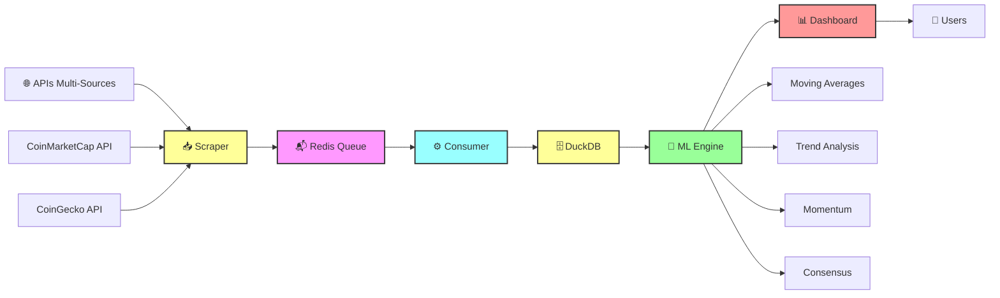
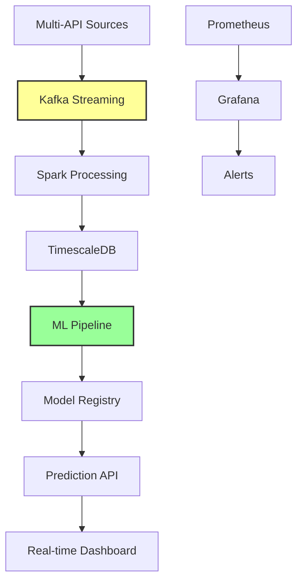

#  CryptoViz - Pipeline Multi-Sources & ML Predictions

<div align="center">


[](https://www.docker.com/)
[](https://streamlit.io/)
[](https://duckdb.org/)
[](https://redis.io/)
[](https://scikit-learn.org/)

**Pipeline complet d'analyse crypto : Scraping Multi-Sources → ML Predictions → Dashboard Temps Réel**

[Demo Live](#demo) • [Architecture Pipeline](#architecture-pipeline) • [Installation](#installation) • [ML Predictions](#ml-predictions) • [Monitoring](#monitoring)

</div>

---

##  À Propos

**CryptoViz** est une plateforme complète d'analyse crypto basée sur une **architecture pipeline robuste** qui collecte, traite et analyse les données de multiples sources en temps réel. Le système combine un **pipeline de données industriel** avec des **prédictions ML avancées** pour offrir une expérience d'analyse crypto complète.

###  Architecture Pipeline ⚡



###  Nouveautés v2.0 🚀

- **🤖 ML Predictions** - 4 modèles avec consensus intelligent intégré au pipeline
- **🔄 Mode Continu** - Analyse temps réel automatique  
- **📱 Multi-Pages** - Navigation fluide entre pipeline monitoring et ML
- **📊 Multi-Sources** - CoinMarketCap + CoinGecko avec comparaisons
- **⚡ Pipeline Robuste** - Architecture microservices Docker avec retry/cache

###  Points Forts Techniques 🔧

- **⚡ Pipeline Temps Réel** - Scraping → Queue → Processing → ML → Dashboard (5min cycles)
- **🔒 Architecture Robuste** - Microservices Docker avec gestion d'erreurs complète
- **🤖 ML Intégré** - Prédictions automatiques sur données pipeline
- **📊 Multi-Sources** - Collecte parallèle CoinMarketCap & CoinGecko
- **💾 Stockage Optimisé** - DuckDB haute performance pour analytics
- **🔄 Auto-Recovery** - Retry logic et monitoring des services
- **📈 Scalable** - Architecture extensible pour nouvelles sources/modèles

---

##  Architecture Pipeline - Cœur du Système

### **🏗️ Microservices Pipeline**

| Service | Technologie | Rôle Pipeline | Status | Port |
|---------|-------------|---------------|--------|------|
| **🌐 Scraper** | Python + Multi-API | Collecte données sources (5min) | 🟢 Active | - |
| **📬 Redis** | Redis 7 Alpine | Queue async + cache | 🟢 Active | 6379 |
| **⚙️ Consumer** | Python + DuckDB | Processing batch + stockage | 🟢 Active | - |
| **📊 Dashboard** | Streamlit + ML | Interface + Prédictions ML | 🟢 Active | 8501 |

### **🔄 Flux de Données Détaillé**

```bash
🎯 CYCLE PIPELINE (toutes les 5 minutes) :

1. 📥 SCRAPER (Collecte Multi-Sources)
   ├── 🔑 CoinMarketCap API (premium data)
   ├── 🆓 CoinGecko API (free data)  
   ├── 📝 Formatage JSON standardisé
   └── 📬 Envoi vers Redis Queue

2. 📬 REDIS QUEUE (Messaging Asynchrone)
   ├── 📋 Stockage messages JSON
   ├── ⏱️ TTL et persistance
   ├── 🔄 Retry sur échecs
   └── 📤 Distribution vers Consumer

3. ⚙️ CONSUMER (Processing Intelligent)
   ├── 📥 Récupération batch (10 items)
   ├── 🔍 Validation et nettoyage
   ├── 💾 Insertion DuckDB transactionnelle
   └── 📊 Logs et métriques

4. 🗄️ DUCKDB (Stockage Analytics)
   ├── 📊 Schema optimisé pour ML
   ├── 🔍 Index sur crypto + timestamp
   ├── ⚡ Requêtes ultra-rapides
   └── 📈 Historique complet pour prédictions

5. 🤖 ML ENGINE (Prédictions Automatiques)
   ├── 📊 Lecture données temps réel
   ├── 🧮 Calculs 4 modèles
   ├── 🎯 Consensus pondéré
   └── 📈 Signaux trading

6. 📊 DASHBOARD (Interface Multi-Pages)
   ├── 🏠 Monitoring pipeline
   ├── 📈 Visualisations temps réel  
   ├── 🤖 ML Predictions interactives
   └── 👤 Expérience utilisateur
```

### **📊 État Pipeline Actuel**

```bash
🟢 SYSTÈME OPÉRATIONNEL (2h+ uptime)

📥 Scraper Status:
   ├── ✅ CoinMarketCap: 10 records/cycle
   ├── ✅ CoinGecko: 10 records/cycle
   ├── ✅ Total: 20 records toutes les 5min
   └── ⏰ Prochain cycle: <5min

📬 Redis Queue:
   ├── ✅ Service actif (port 6379)
   ├── 📨 Messages en transit
   └── 💾 Persistance données

⚙️ Consumer Status:  
   ├── ✅ Processing actif
   ├── 📊 DuckDB connecté
   └── 💤 En attente nouvelles données

📊 Dashboard:
   ├── ✅ Interface disponible :8501
   ├── 🤖 ML Engine prêt
   └── 📱 Multi-pages opérationnelles
```

---

##  Demo Pipeline Live

**🌐 Version Live :** [crypto.silentcry.fr](http://crypto.silentcry.fr)

###  Pages Pipeline

```
🏠 Monitoring Pipeline
├── 📊 État services temps réel
├── 📈 Métriques ingestion (records, cryptos, sources)
├── ⏰ Dernière collecte et fraîcheur données
└── 🔍 Debug et diagnostics pipeline

📊 Dashboard Données Pipeline  
├── 📈 Visualisations données collectées
├── 🔄 Comparaisons multi-sources
├── 📊 Graphiques temps réel pipeline
└── 🎛️ Contrôles filtrage avancés

🤖 ML Predictions (Pipeline → ML)
├── 📊 Données pipeline → Modèles ML
├── 🔮 Prédictions basées collecte temps réel
├── 🎯 Consensus sur données multi-sources
└── 📈 Signaux trading automatisés
```

### **⚡ Aperçu Pipeline Temps Réel**

```
🔄 Pipeline CryptoViz - Status Live

📥 INGESTION (dernières 5min)
┌─────────────────┬─────────────────┬─────────────────┬─────────────────┐
│     Source      │    Records      │   Last Update   │     Status      │
├─────────────────┼─────────────────┼─────────────────┼─────────────────┤
│  CoinMarketCap  │       10        │    2min ago     │      🟢 OK      │
│    CoinGecko    │       10        │    2min ago     │      🟢 OK      │
│      TOTAL      │       20        │    2min ago     │   ⚡ STREAMING  │
└─────────────────┴─────────────────┴─────────────────┴─────────────────┘

💾 STOCKAGE DuckDB
┌─────────────────┬─────────────────┬─────────────────┬─────────────────┐
│  Total Records  │     Cryptos     │  Oldest Data    │  Latest Data    │
├─────────────────┼─────────────────┼─────────────────┼─────────────────┤
│      8,720      │       12        │    2 days ago   │    2min ago     │
└─────────────────┴─────────────────┴─────────────────┴─────────────────┘

🤖 ML PREDICTIONS (Pipeline → AI)
┌─────────────────┬─────────────────┬─────────────────┬─────────────────┐
│    Bitcoin      │   Prediction    │    Confidence   │     Signal      │
├─────────────────┼─────────────────┼─────────────────┼─────────────────┤
│   $67,234.50    │   $67,787       │      75%        │   🟢 ACHAT      │
└─────────────────┴─────────────────┴─────────────────┴─────────────────┘
```

---

##  Installation Pipeline

### Prérequis Pipeline

- 🐳 **Docker** & **Docker Compose** (pipeline microservices)
- 🔑 **API Key CoinMarketCap** ([obtenir ici](https://pro.coinmarketcap.com/signup))
- 🌐 **Ports** 8501 (dashboard) & 6379 (redis) disponibles

###  Démarrage Pipeline Complet

```bash
# 1. Cloner le projet complet
git clone https://gitlab.com/exesiga/crypto-viz.git
cd crypto-viz

# 2. Configuration API (pour scraper)
nano scraper/providers/coinmarketcap.py  # Remplacer API_KEY

# 3. Lancement stack pipeline complète
docker-compose up -d

# 4. Vérification pipeline
docker-compose ps
# Tous services doivent être "Up"

# 5. Monitoring temps réel pipeline
docker-compose logs -f scraper    # Collecte données
docker-compose logs -f consumer   # Processing données  
docker-compose logs -f dashboard  # Interface ML

# 6. Accès interface complète
open http://localhost:8501
```

**⚡ En 30 secondes, votre pipeline crypto complet avec ML tourne !**

---

##  Pipeline Monitoring & Debugging

### **📊 Commandes Pipeline Essentielles**

```bash
# === MONITORING PIPELINE GLOBAL ===
docker-compose ps                    # Status tous services
docker-compose logs --tail=20       # Logs globaux
docker-compose top                   # Ressources CPU/RAM

# === MONITORING PAR SERVICE ===
# 📥 Scraper (collecte données)
docker-compose logs -f scraper --tail=10
curl -s http://redis:6379            # Test Redis connectivity

# ⚙️ Consumer (processing)  
docker-compose logs -f consumer --tail=10
docker exec crypto_consumer python -c "
import duckdb
conn = duckdb.connect('/data/crypto_analytics.duckdb', read_only=True)
print(f'Total records: {conn.execute(\"SELECT COUNT(*) FROM crypto_prices\").fetchone()[0]}')
print(f'Latest: {conn.execute(\"SELECT MAX(timestamp) FROM crypto_prices\").fetchone()[0]}')
"

# 📊 Dashboard + ML
docker-compose logs -f dashboard --tail=10
curl -s http://localhost:8501        # Test interface

# === MÉTRIQUES PIPELINE ===
# Vitesse ingestion
docker exec crypto_consumer python -c "
import duckdb
from datetime import datetime, timedelta
conn = duckdb.connect('/data/crypto_analytics.duckdb', read_only=True)
recent = conn.execute('SELECT COUNT(*) FROM crypto_prices WHERE timestamp >= ?', 
                     [datetime.now() - timedelta(hours=1)]).fetchone()[0]
print(f'Records dernière heure: {recent}')
print(f'Vitesse: {recent} records/h')
"
```

### **🔧 Troubleshooting Pipeline**

<details>
<summary><strong>🔴 Pipeline arrêté/lent</strong></summary>

```bash
# Diagnostic rapide
docker-compose ps | grep -v "Up"     # Services en panne

# Redémarrage pipeline complet
docker-compose restart

# Redémarrage sélectif
docker-compose restart scraper       # Si collecte bloquée
docker-compose restart consumer      # Si processing bloqué  
docker-compose restart dashboard     # Si interface ML bloquée
```
</details>

<details>
<summary><strong>🔴 Pas de nouvelles données pipeline</strong></summary>

```bash
# 1. Vérifier scraper
docker-compose logs scraper --tail=20
# Doit montrer cycles toutes les 5min

# 2. Vérifier Redis queue
docker exec crypto_redis redis-cli llen crypto_queue
# Doit avoir des messages en queue

# 3. Vérifier consumer  
docker-compose logs consumer --tail=20
# Doit traiter les messages

# 4. Test API CoinMarketCap
curl -H "X-CMC_PRO_API_KEY: YOUR_KEY" \
  "https://pro-api.coinmarketcap.com/v1/cryptocurrency/listings/latest?limit=1"
```
</details>

<details>
<summary><strong>🔴 ML Predictions incohérentes</strong></summary>

```bash
# Vérifier données pipeline pour ML
docker exec crypto_consumer python -c "
from datetime import datetime, timedelta
import duckdb
conn = duckdb.connect('/data/crypto_analytics.duckdb', read_only=True)
recent_data = conn.execute('''
  SELECT COUNT(*) as count, MIN(price), MAX(price), AVG(price) 
  FROM crypto_prices 
  WHERE name='Bitcoin' AND timestamp >= ?
''', [datetime.now() - timedelta(hours=24)]).fetchone()
print(f'Bitcoin 24h: {recent_data}')
"

# Si données insuffisantes, attendre plus de cycles pipeline
# Ou réduire historique ML: 24h → 6h
```
</details>

---

##  ML Predictions (Pipeline → AI) 

### **🤖 Modèles Pipeline-Driven**

Tous les modèles ML utilisent **directement les données du pipeline temps réel** :

#### **1. Moving Averages (Pipeline Data)**
```python
# Utilise données collectées par scraper → consumer → DuckDB
data_pipeline = get_crypto_data('Bitcoin', 24, 'pipeline')
ma_short = data_pipeline['price'].rolling(window=20).mean()
ma_long = data_pipeline['price'].rolling(window=50).mean()
```

#### **2. Trend Analysis (Multi-Source)**
```python  
# Combine données CoinMarketCap + CoinGecko du pipeline
pipeline_data = get_multi_source_data('Bitcoin', 24)
trend_prediction = linear_regression(pipeline_data.price, horizon=4)
```

#### **3. Momentum (Real-Time Pipeline)**
```python
# Calcul sur flux temps réel du pipeline
momentum = pipeline_data['price'].diff(window=14)
future_price = current_price + momentum_avg * horizon
```

#### **4. Consensus (Pipeline Sources)**
```python
# Consensus pondéré sur toutes sources pipeline
consensus = weighted_average([
    ma_short_prediction,    # 30%
    ma_long_prediction,     # 20%  
    trend_prediction,       # 30%
    momentum_prediction     # 20%
])
```

### **🔄 Integration Pipeline → ML**

```bash
📊 DONNÉES PIPELINE → 🤖 ML ENGINE → 📈 PRÉDICTIONS

Pipeline Flow:
┌─────────────────┐    ┌─────────────────┐    ┌─────────────────┐
│  Scraper APIs   │───▶│   DuckDB Store  │───▶│   ML Models     │
│  (5min cycles)  │    │  (time-series)  │    │  (predictions)  │
└─────────────────┘    └─────────────────┘    └─────────────────┘
         │                        │                        │
         ▼                        ▼                        ▼
  📥 Multi-sources         💾 Optimized         🎯 4 Models
  CoinMarketCap           for ML queries        + Consensus
  + CoinGecko             + indexes             + Confidence
```

---

##  Fonctionnalités Pipeline + ML

<table>
<tr>
<td width="50%">

### **⚡ Pipeline Temps Réel**

**🌐 Collecte Multi-Sources**
- **Scraper robuste** - CoinMarketCap + CoinGecko
- **Cycles 5min** - Données fraîches automatiques
- **Retry logic** - Gestion pannes APIs
- **Format standardisé** - JSON normalisé

**📬 Queue Asynchrone**  
- **Redis messaging** - Buffer anti-pics
- **Processing batch** - Optimisation performance
- **Persistance** - Pas de perte données
- **Monitoring** - Métriques queue

**💾 Stockage Optimisé**
- **DuckDB analytics** - Requêtes ultra-rapides
- **Schema ML** - Optimisé pour prédictions
- **Index temporels** - Performance time-series
- **Compression** - Stockage efficace

</td>
<td width="50%">

### **🤖 ML Sur Pipeline**

**🔮 Prédictions Temps Réel**
- **Données pipeline** - Fraîcheur garantie
- **4 modèles** - MA, Trend, Momentum, Consensus
- **Multi-sources** - CoinMarketCap + CoinGecko
- **Mode continu** - Analyse automatique

**📊 Interface Pipeline**
- **Monitoring services** - Status temps réel
- **Métriques ingestion** - Records, vitesses
- **Debug pipeline** - Logs et diagnostics
- **Navigation ML** - Pipeline → Prédictions

**🎯 Signaux Trading**
- **Pipeline → ML** - Données temps réel → Signaux
- **Consensus multi-sources** - Fiabilité accrue
- **Confiance calculée** - Volatilité intégrée
- **Alertes automatiques** - ACHAT/VENTE/HOLD

</td>
</tr>
</table>

---

##  Extensions Pipeline

### **🚀 Roadmap Pipeline v3.0**

- [ ] **🔄 Sources Supplémentaires** - Binance, Kraken, Coinbase APIs
- [ ] **⚡ Pipeline Streaming** - Kafka pour volume élevé
- [ ] **🤖 ML Pipeline** - MLflow pour modèles en production  
- [ ] **📊 Métriques Avancées** - Prometheus + Grafana monitoring
- [ ] **🔔 Alertes Pipeline** - Notifications pannes/anomalies
- [ ] **☁️ Cloud Pipeline** - Kubernetes deployment
- [ ] **📈 Backtesting Pipeline** - Validation historique modèles
- [ ] **🔌 API Pipeline** - REST endpoints données temps réel

### **🔧 Architecture Pipeline Future**



---

##  Performance Pipeline

### **⚡ Métriques Actuelles**

```bash
📊 PERFORMANCE PIPELINE (Status Actuel):

🚀 Ingestion:
   ├── 📥 20 records / 5min (240 records/h)
   ├── 🔄 2 sources parallèles
   ├── ⏱️ <30s latence collecte → stockage
   └── 💾 8,720+ records historiques

⚙️ Processing:
   ├── 📊 Batch processing optimisé
   ├── 🗄️ DuckDB requêtes <100ms
   ├── 🤖 ML prédictions <2s
   └── 📈 Interface responsive <1s

🔧 Ressources:
   ├── 🐳 4 containers Docker
   ├── 💾 <100MB RAM total
   ├── 🗂️ <50MB stockage/jour
   └── ⚡ CPU minimal (idle 90%+)
```

### **📈 Scalabilité Pipeline**

```python
# Configuration scaling pipeline
PIPELINE_CONFIG = {
    'scraper': {
        'interval': 300,           # 5min (peut descendre à 60s)
        'sources': 2,              # Extensible à 10+
        'concurrent_requests': 5,   # Parallélisation
        'retry_attempts': 3
    },
    'queue': {
        'redis_maxmemory': '256mb', # Extensible
        'batch_size': 10,           # Optimisable 50+
        'worker_threads': 2         # Scalable
    },
    'storage': {
        'duckdb_memory': '512mb',   # Extensible 4GB+
        'compression': True,        # Optimisé
        'retention_days': 30        # Configurable
    },
    'ml': {
        'cache_ttl': 300,          # 5min cache
        'models_parallel': True,    # Concurrent
        'prediction_batch': True    # Optimisé
    }
}
```

---

##  Support Pipeline

<div align="center">

### 💬 **Support Pipeline & ML**

[](https://github.com/user/crypto-viz/issues)
[](https://gitlab.com/exesiga/crypto-viz/-/issues)

**🔧 Problème Pipeline ?** → [Pipeline Bug Report](https://gitlab.com/exesiga/crypto-viz/-/issues/new?issuable_template=pipeline_issue)  
**🤖 Question ML ?** → [ML Discussion](https://gitlab.com/exesiga/crypto-viz/-/issues/new?issuable_template=ml_question)  
**⚡ Performance ?** → [Optimization Request](https://gitlab.com/exesiga/crypto-viz/-/issues/new?issuable_template=performance)

</div>

---

##  Licence

MIT License - voir [LICENSE](LICENSE) pour plus de détails.

---

<div align="center">

**⭐ Pipeline Crypto + ML qui fonctionne en production ! Donnez une étoile ! ⭐**

Made with ⚡, 🤖 and ☕ by [SigA](https://gitlab.com/exesiga)

[](https://gitlab.com/exesiga/crypto-viz)
[](https://gitlab.com/exesiga/crypto-viz/-/forks)

**🔄 Pipeline Status: 🟢 OPERATIONAL** | **📊 ML Engine: 🟢 READY** | **⚡ Uptime: 2h+**

</div>
