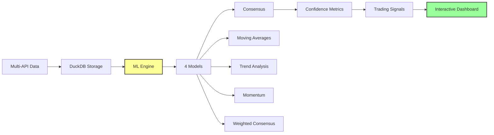

#  CryptoViz - Dashboard Multi-Sources & ML Predictions

<div align="center">


[](https://www.docker.com/)
[](https://streamlit.io/)
[](https://duckdb.org/)
[](https://redis.io/)
[](https://scikit-learn.org/)

**Plateforme avancée d'analyse crypto avec prédictions ML et dashboard multi-sources**

[Demo Live](#demo) • [Installation](#installation) • [Fonctionnalités](#fonctionnalités) • [ML Predictions](#ml-predictions) • [Architecture](#architecture)

</div>

---

##  À Propos

**CryptoViz** est une plateforme moderne d'analyse des cryptomonnaies qui combine la visualisation temps réel avec des **prédictions machine learning avancées**. Le système collecte des données depuis multiples sources (CoinMarketCap & CoinGecko), les traite avec des algorithmes ML, et offre une interface multi-pages interactive pour l'exploration et l'analyse prédictive.

###  Nouveautés v2.0

-  **ML Predictions** - 4 modèles de prédiction avec consensus intelligent
-  **Mode Continu** - Analyse temps réel automatique  
-  **Dashboard Multi-Pages** - Navigation fluide entre fonctionnalités
-  **Multi-Sources** - CoinMarketCap + CoinGecko avec comparaison
-  **Interface Interactive** - Sélection crypto optimisée et responsive

###  Points Forts

-  **Machine Learning** - Prédictions prix avec 4 modèles (MA, Tendance, Momentum, Consensus)
-  **Multi-Sources** - Collecte CoinMarketCap & CoinGecko avec comparaisons
-  **Streaming temps réel** - Données mises à jour toutes les 5 minutes
-  **Interface moderne** - Dashboard multi-pages Streamlit avec navigation
-  **Architecture scalable** - Microservices avec Docker Compose
-  **Analytics avancées** - DuckDB pour requêtes ultra-rapides
-  **Pipeline robuste** - Gestion d'erreur et retry automatique

---

##  Demo

** Version Live :** [crypto.silentcry.fr](http://crypto.silentcry.fr)

###  Pages Disponibles

```
🏠 Page d'Accueil
├── Statut système temps réel
├── Métriques globales (records, cryptos, sources)
└── Guide des fonctionnalités

📊 Dashboard Multi-Sources  
├── Visualisations comparatives
├── Filtrage par source (CoinMarketCap/CoinGecko)
├── Graphiques interactifs Plotly
└── 3 modes d'affichage (unique, séparés, pourcentage)

🤖 ML Predictions
├── 4 modèles ML: MA courte/longue, Tendance, Momentum
├── Consensus pondéré avec métriques de confiance  
├── Mode continu pour exploration interactive
├── Graphiques prédictifs avec horizons temporels
└── Signaux de trading automatisés (ACHAT/VENTE/HOLD)
```

###  Aperçu ML Predictions

```
 Analyse ML : Bitcoin (Mode Continu)

 Métriques Actuelles
┌─────────────────┬─────────────────┬─────────────────┬─────────────────┐
│   Prix Actuel   │    Variation    │   Volatilité    │     Points      │
│   $67,234.50    │     +2.34%      │     12.45%      │       362       │
└─────────────────┴─────────────────┴─────────────────┴─────────────────┘

 Prédictions (4h)
┌─────────────────┬─────────────────┬─────────────────┬─────────────────┐
│     Modèle      │   Prix Prédit   │   Variation     │   Confiance     │
├─────────────────┼─────────────────┼─────────────────┼─────────────────┤
│     MA 20       │   $67,890       │     +0.97%      │      78%        │
│     MA 50       │   $67,456       │     +0.33%      │      82%        │
│    Tendance     │   $68,123       │     +1.32%      │      71%        │
│    Momentum     │   $67,678       │     +0.66%      │      69%        │
│    CONSENSUS    │   $67,787       │     +0.82%      │      75%        │
└─────────────────┴─────────────────┴─────────────────┴─────────────────┘

 Signal de Trading: 🟢 ACHAT (Confiance: 75%)
```

---

##  Installation Rapide

### Prérequis

- 🐳 **Docker** & **Docker Compose** installés
- 🔑 **API Key CoinMarketCap** ([obtenir ici](https://pro.coinmarketcap.com/signup))
- 🌐 **Port 8501** disponible

###  Démarrage en 30 secondes

```bash
# 1. Cloner le projet
git clone https://gitlab.com/exesiga/crypto-viz.git
cd crypto-viz

# 2. Configurer l'API Key CoinMarketCap
nano scraper/providers/coinmarketcap.py  # Remplacer API_KEY

# 3. Lancer la stack complète
docker compose up -d

# 4. Accéder au dashboard multi-pages
open http://localhost:8501
```

** C'est tout ! Votre dashboard crypto avec ML est maintenant actif.**

---

##  Fonctionnalités

###  ** Dashboard Multi-Sources**

<table>
<tr>
<td width="50%">

** Sources de Données**
- **CoinMarketCap** - API premium avec données fiables
- **CoinGecko** - API gratuite pour comparaisons
- **Comparaisons** - Écarts prix entre sources
- **Métriques** - Stats par source et crypto

** Modes de Visualisation**
- **Graphique unique** - Échelle partagée
- **Graphiques séparés** - Échelles individuelles  
- **Vue pourcentage** - Variations relatives
- **Comparaison sources** - Overlay multi-providers

</td>
<td width="50%">

** Contrôles Avancés**
- Sélection multi-cryptos
- Filtrage par source
- Filtrage par période
- Actualisation automatique
- Cache intelligent (30-60s)

** Métriques Temps Réel**
- Total d'enregistrements
- Cryptomonnaies suivies
- Sources actives
- Dernière mise à jour
- Statut streaming

</td>
</tr>
</table>

###  ** ML Predictions - Nouveauté !**

<table>
<tr>
<td width="50%">

** 4 Modèles ML Avancés**
- **Moyennes Mobiles** - MA courte (5-30) & longue (20-100)
- **Analyse de Tendance** - Régression linéaire avec pente
- **Momentum** - Calcul vitesse changement prix
- **Consensus Pondéré** - Agrégation intelligente 4 modèles

** Mode Continu Intelligent**
-  **Analyse automatique** à chaque changement
-  **Détection paramètres** - Crypto, historique, modèles
-  **Cache optimisé** - Évite recalculs inutiles
-  **Horodatage** - Suivi dernière analyse

</td>
<td width="50%">

** Interface Interactive**
-  **Sélection crypto** - Boutons individuels (12+ cryptos)
-  **Configuration ML** - Ajustement paramètres temps réel
-  **Graphiques prédictifs** - Visualisation futures
-  **Signaux trading** - ACHAT/VENTE/HOLD automatisés

** Métriques de Confiance**
- **Scores individuels** - Confiance par modèle (0-100%)
- **Consensus global** - Moyenne pondérée
- **Volatilité** - Facteur de risque intégré
- **Historique** - Analyse 6h à 72h

</td>
</tr>
</table>

###  ** Navigation Multi-Pages**

```
🏠 Page d'Accueil
├──  État système (connexions, données, sources)
├──  Guide fonctionnalités
├──  Avertissements et disclaimers
└──  Navigation vers Dashboard/ML

📊 Dashboard Multi-Sources  
├──  Contrôles filtrage avancés
├──  Visualisations comparatives
├──  Modes d'affichage multiples
└──  Interface responsive

🤖 ML Predictions
├──  Sélection crypto interactive
├──  Configuration modèles ML
├──  Prédictions et consensus
├──  Graphiques temps réel
├──  Mode continu/manuel
└──  Signaux de trading
```

---

##  ML Predictions - Guide Complet

### ** Modèles Disponibles**

#### **1. Moyennes Mobiles (MA)**
```python
# MA Courte (5-30 points) - Réactivité tendances
# MA Longue (20-100 points) - Stabilité long terme
ma_short = prix.rolling(window=20).mean()
ma_long = prix.rolling(window=50).mean()

# Signal: MA courte > MA longue → HAUSSIER
```

#### **2. Analyse de Tendance**
```python  
# Régression linéaire sur historique
# Projection future basée sur pente
coeffs = np.polyfit(x, prix, 1)
prix_futur = pente * heures_futures + intercept
```

#### **3. Momentum**
```python
# Vitesse de changement sur période
# Indique accélération/décélération
momentum = prix.diff(window=14)
prix_predit = prix_actuel + momentum_moyen * horizon
```

#### **4. Consensus Pondéré**
```python
# Agrégation intelligente 4 modèles
poids = {
    'ma_short': 0.3,   # Réactivité
    'ma_long': 0.2,    # Stabilité  
    'trend': 0.3,      # Direction
    'momentum': 0.2    # Vitesse
}
consensus = Σ(modèle * poids)
```

### ** Métriques de Confiance**

```python
# Calcul confiance par modèle
deviation = abs(prix_predit - prix_actuel)
confiance_base = max(0, 100 - (deviation/prix_actuel)*100)

# Facteur volatilité
volatilite = std_20_jours / prix_moyen * 100
confiance_ajustee = confiance_base * (1 - volatilite/200)

# Confiance finale (0-100%)
confiance = max(0, min(100, confiance_ajustee))
```

### ** Signaux de Trading**

```python
# Logique des signaux
consensus_variation = (consensus - prix_actuel) / prix_actuel * 100
confiance_moyenne = mean(toutes_confidences)

if consensus_variation > 2% AND confiance_moyenne > 60%:
    signal = "🟢 ACHAT"
elif consensus_variation < -2% AND confiance_moyenne > 60%:  
    signal = "🔴 VENTE"
else:
    signal = "🟡 HOLD"
```

### ** Mode Continu**

```python
# Détection changements automatique
params_actuels = {
    'crypto': crypto_selectionnee,
    'historique': heures_analyse,
    'prediction': heures_futures,
    'source': source_donnees,
    'ma_short': fenetre_courte,
    'ma_long': fenetre_longue,
    'momentum': periode_momentum
}

# Relance analyse si changement détecté
if params_actuels != params_precedents:
    lancer_analyse_ml()
    params_precedents = params_actuels
```

---

##  Architecture Technique

###  **Microservices Docker**

| Service | Technologie | Rôle | Port |
|---------|-------------|------|---------|
| **Scraper** | Python + Multi-API | Collecte CoinMarketCap + CoinGecko | - |
| **Consumer** | Python + DuckDB | Traitement et stockage | - |
| **Dashboard** | Streamlit Multi-Pages | Interface + ML Engine | 8501 |
| **Redis** | Redis 7 Alpine | Queue de messages | 6379 |

###  **Nouvelle Architecture Multi-Pages**

```
dashboard/
├── app.py                 # Page d'accueil + navigation
├── pages/                 # Structure multi-pages
│   ├── 1_Dashboard.py     # Dashboard multi-sources  
│   └── 2_ML_Predictions.py # Prédictions ML
└── utils/                 # Code partagé
    ├── database.py        # Fonctions BDD centralisées
    └── ml_models.py       # Modèles ML réutilisables
```

###  **Schema DuckDB Étendu**

```sql
-- Table principale (existante)
CREATE TABLE crypto_prices (
    name VARCHAR,                -- Nom crypto
    symbol VARCHAR,             -- Symbole (BTC, ETH...)  
    price DOUBLE,               -- Prix USD
    percent_change_24h DOUBLE,  -- Variation 24h
    market_cap DOUBLE,          -- Capitalisation
    volume_24h DOUBLE,          -- Volume 24h  
    source VARCHAR,             -- 'coinmarketcap' | 'coingecko'
    timestamp TIMESTAMP         -- Horodatage
);

-- Index pour performance ML
CREATE INDEX idx_crypto_time ON crypto_prices(name, timestamp);
CREATE INDEX idx_source_time ON crypto_prices(source, timestamp);
```

###  **Pipeline ML**



---

##  Configuration

###  **Variables ML**

```python
# Configuration Modèles ML
ML_CONFIG = {
    'moving_averages': {
        'short_window': (5, 30),    # Range MA courte
        'long_window': (20, 100),   # Range MA longue
        'default_short': 20,
        'default_long': 50
    },
    'trend': {
        'min_points': 10,           # Points minimum régression
        'polynomial_degree': 1      # Régression linéaire
    },
    'momentum': {
        'window_range': (5, 30),    # Range période momentum
        'default_window': 14,
        'smoothing': 10            # Lissage moyenne
    },
    'consensus': {
        'weights': {               # Poids modèles
            'ma_short': 0.3,
            'ma_long': 0.2, 
            'trend': 0.3,
            'momentum': 0.2
        }
    },
    'confidence': {
        'volatility_threshold': 200, # Seuil ajustement volatilité
        'min_confidence': 0,         # Confiance minimum
        'max_confidence': 100        # Confiance maximum
    }
}
```

###  **Configuration Streamlit**

```python  
# Configuration Pages
STREAMLIT_CONFIG = {
    'page_config': {
        'page_title': "CryptoViz - Multi-Sources & ML",
        'layout': "wide",
        'initial_sidebar_state': "expanded"
    },
    'cache_config': {
        'ttl': 300,                # 5 minutes cache
        'max_entries': 1000,
        'allow_output_mutation': False
    },
    'session_state': {
        'selected_crypto': 'Bitcoin',
        'analysis_results': None,
        'last_params': {}
    }
}
```

---

##  Utilisation Avancée

###  **Interface ML Predictions**

#### **1. Sélection Crypto**
```bash
# Interface boutons individuels (résout problème selectbox)
Bitcoin ✅     Ethereum      Solana        XRP
BNB           Dogecoin      TRON          Cardano  
USDC          USDT          Others...
```

#### **2. Configuration Analyse**
```bash
# Paramètres temporels
Historique: [6h ────────●────────── 72h] 24h
Prédiction: [1h ──●────────────────── 24h] 4h

# Sources données  
☑️ Toutes sources ☐ CoinMarketCap ☐ CoinGecko

# Modèles ML
MA Courte:  [5 ──●────────────── 30] 20 points
MA Longue:  [20 ────────●─────── 100] 50 points  
Momentum:   [5 ────●──────────── 30] 14 périodes
```

#### **3. Mode d'Analyse**
```bash
# Mode Manuel
 [ANALYSER] ← Clic pour lancer

# Mode Continu   
   Analyse automatique activée
   Détection changements en temps réel
   Mise à jour instantanée graphiques
```

###  **Commandes de Monitoring**

```bash
# Monitoring ML en temps réel
docker compose logs -f --tail=20 dashboard

# Vérification données pour ML
docker exec crypto_consumer python -c "
import duckdb
conn = duckdb.connect('/data/crypto_analytics.duckdb', read_only=True)
print('=== STATS ML ===')
print('Cryptos:', conn.execute('SELECT COUNT(DISTINCT name) FROM crypto_prices').fetchone()[0])
print('Points 24h:', conn.execute('SELECT COUNT(*) FROM crypto_prices WHERE timestamp >= NOW() - INTERVAL 24 HOURS').fetchone()[0]) 
print('Sources:', conn.execute('SELECT DISTINCT source FROM crypto_prices').fetchall())
"

# Test des modèles ML  
docker exec crypto_dashboard python -c "
import sys
sys.path.append('/app')
from utils.database import get_crypto_data
from utils.ml_models import predict_price_ensemble

# Test prédiction Bitcoin
data = get_crypto_data('Bitcoin', 24, None)
if not data.empty:
    predictions = predict_price_ensemble(data, 4)
    print('Prédictions Bitcoin 4h:', predictions)
else:
    print('Pas de données Bitcoin')
"
```

###  **Debugging ML**

```bash
# Vérification session state
# Dans Streamlit sidebar → section "🔍 État Actuel"
Session State: Bitcoin
Cryptos disponibles: 12

# Logs analyse ML
docker compose logs dashboard | grep -E "(ML|predict|analysis)"

# Performance prédictions
docker exec crypto_dashboard python -c "
import time
start = time.time()
# ... code ML predictions ...
print(f'Temps analyse ML: {time.time() - start:.2f}s')
"
```

---

##  API & Extensions

###  **API Endpoints Potentiels**

```python
# Future API REST pour ML Predictions
GET /api/v1/predictions/{crypto}?hours={horizon}&models={list}
GET /api/v1/confidence/{crypto}?window={period}  
GET /api/v1/signals/{crypto}?threshold={percent}
POST /api/v1/analysis/batch
```

###  **Extensions Possibles**

```python  
# Nouveaux modèles ML
- ARIMA pour séries temporelles
- LSTM réseaux neurones  
- Prophet pour saisonnalité
- Ensemble methods avancés

# Indicateurs techniques
- RSI (Relative Strength Index)
- MACD (Moving Average Convergence Divergence)
- Bollinger Bands
- Stochastic Oscillator

# Sources supplémentaires
- Binance API
- Kraken API  
- Coinbase Pro
- CryptoCompare
```

---

##  Dépannage ML

###  **Problèmes ML Courants**

<details>
<summary><strong>🔴 Sélection crypto ne fonctionne pas</strong></summary>

**Solution implémentée :** Boutons individuels au lieu de selectbox

```bash
# Vérification session state
# Dans dashboard → Sidebar "🔍 État Actuel"
Session State: Bitcoin ← doit changer en cliquant autres cryptos

# Si problème persiste
docker compose restart dashboard
```
</details>

<details>
<summary><strong>🔴 Prédictions incohérentes</strong></summary>

**Symptômes :** Prédictions ML illogiques ou extrêmes

**Solutions :**
```bash
# Vérifier données historiques
docker exec crypto_dashboard python -c "
from utils.database import get_crypto_data
data = get_crypto_data('Bitcoin', 24, None)
print('Points disponibles:', len(data))
print('Prix min/max:', data['price'].min(), data['price'].max())
print('Derniers prix:', data['price'].tail())
"

# Ajuster paramètres ML (historique plus long)
Historique: 6h → 24h → 48h
```
</details>

<details>
<summary><strong>🔴 Mode continu ne se déclenche pas</strong></summary>

**Symptômes :** Changements paramètres sans relance analyse

**Solutions :**
```bash
# Vérifier état session
# Dans Streamlit: section debug montre derniers paramètres

# Forcer actualisation
# Désactivez/réactivez mode continu
# Ou changez crypto puis rechangez
```
</details>

<details>
<summary><strong>🔴 Graphiques ML lents</strong></summary>

**Symptômes :** Chargement lent des visualisations

**Solutions :**
```bash
# Réduire historique d'analyse
Historique: 72h → 24h → 12h

# Vider cache Streamlit
docker compose restart dashboard

# Optimiser paramètres
MA Longue: 100 → 50 → 30 points
```
</details>

---

##  Contribution

###  **Développement ML**

```bash
# Setup environnement ML
pip install scikit-learn numpy pandas plotly streamlit

# Structure développement
crypto-viz/
├── dashboard/utils/
│   ├── ml_models.py       # Nouveaux modèles ici
│   └── database.py        # Fonctions données
├── tests/
│   ├── test_ml_models.py  # Tests unitaires ML
│   └── test_predictions.py
└── notebooks/             # Analyse exploratoire
    └── ml_experiments.ipynb
```

###  **Ajout Nouveau Modèle ML**

```python  
# Dans dashboard/utils/ml_models.py
def predict_custom_model(df, hours_ahead=1, **params):
    """
    Nouveau modèle ML personnalisé
    """
    # Votre logique ici
    prediction = custom_algorithm(df, hours_ahead, params)
    return prediction

# Dans pages/2_ML_Predictions.py  
# Ajouter à la liste des modèles
predictions = {
    'ma_short': predict_moving_average(data, 'short'),
    'ma_long': predict_moving_average(data, 'long'), 
    'trend': predict_trend(data),
    'momentum': predict_momentum(data),
    'custom': predict_custom_model(data),  # ← Nouveau
    'consensus': calculate_consensus(predictions)
}
```

###  **Roadmap v3.0**

- [ ]  ** ML Avancé** - LSTM, ARIMA, Prophet pour crypto
- [ ]  ** Indicateurs Techniques** - RSI, MACD, Bollinger  
- [ ]  ** Alertes Intelligentes** - ML-driven notifications
- [ ]  ** API REST** - Endpoints ML predictions
- [ ]  ** Multi-utilisateurs** - Comptes et portefeuilles

---

##  Licence

MIT License - voir [LICENSE](LICENSE) pour plus de détails.

---

##  Support & ML Help

<div align="center">

### 💬 **Besoin d'aide ?**

[](https://github.com/user/crypto-viz/issues)
[](https://gitlab.com/exesiga/crypto-viz/-/issues)

** Problème ML ?** → [Ouvrir une issue ML](https://gitlab.com/exesiga/crypto-viz/-/issues/new?issuable_template=ml_prediction_bug)  
** Nouvelle fonctionnalité ?** → [Feature Request](https://gitlab.com/exesiga/crypto-viz/-/issues/new?issuable_template=feature_request)  
** Question ML ?** → [Discussion ML](https://gitlab.com/exesiga/crypto-viz/-/issues/new?issuable_template=ml_question)

</div>

---

<div align="center">

** Si CryptoViz + ML vous aide dans vos analyses crypto, donnez-lui une étoile ! **

Made with ❤️, ☕ by [Siga](https://gitlab.com/exesiga)

[](https://gitlab.com/exesiga/crypto-viz)
[](https://gitlab.com/exesiga/crypto-viz/-/forks)

</div>
