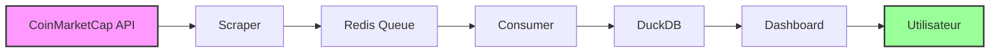

# 📊 CryptoViz - Dashboard de Visualisation Crypto en Temps Réel

<div align="center">


[](https://www.docker.com/)
[](https://streamlit.io/)
[](https://duckdb.org/)
[](https://redis.io/)

**Plateforme complète de visualisation des cryptomonnaies avec streaming temps réel**

[🚀 Demo Live](#demo) • [⚡ Installation](#installation) • [📊 Fonctionnalités](#fonctionnalités) • [🛠️ Architecture](#architecture)

</div>

---

## 🎯 À Propos

**CryptoViz** est une plateforme moderne de visualisation des cryptomonnaies qui collecte, traite et affiche les données de prix en temps réel. Utilisant une architecture microservices robuste avec Docker, le système offre des graphiques interactifs et des analyses avancées pour suivre les tendances du marché crypto.

### ✨ Points Forts

- 📈 **Streaming temps réel** - Données mises à jour toutes les 5 minutes
- 🎨 **Graphiques interactifs** - Powered by Plotly avec 3 modes d'affichage
- ⚡ **Architecture scalable** - Microservices avec Docker Compose
- 💾 **Base analytique** - DuckDB pour des requêtes ultra-rapides
- 🔄 **Pipeline robuste** - Gestion d'erreur et retry automatique
- 🌐 **Interface moderne** - Dashboard Streamlit responsive

---

## 🚀 Demo

**🌐 Version Live :** [crypto.silentcry.fr](http://crypto.silentcry.fr)

### 📸 Aperçu

```
📊 CryptoViz Dashboard - Analyse Temps Réel des Cryptomonnaies

┌─────────────────────────────────────────────────────────────┐
│  💰 Cryptos haute valeur (>$1000): Bitcoin, Ethereum, BNB  │
│  💎 Cryptos moyenne valeur ($1-$1000): XRP, Cardano...     │
│  🪙 Cryptos petite valeur (<$1): USDC, USDT, Dogecoin...   │
└─────────────────────────────────────────────────────────────┘

📊 Données chargées: 160 lignes
🟢 Streaming actif (dernière donnée: 45s)
```

---

## ⚡ Installation Rapide

### Prérequis

- 🐳 **Docker** & **Docker Compose** installés
- 🔑 **API Key CoinMarketCap** ([obtenir ici](https://pro.coinmarketcap.com/signup))
- 🌐 **Port 8501** disponible

### 🚀 Démarrage en 30 secondes

```bash
# 1. Cloner le projet
git clone https://github.com/user/crypto-viz.git
cd crypto-viz

# 2. Configurer l'API Key
nano scraper/app.py  # Remplacer API_KEY par votre clé

# 3. Lancer la stack complète
docker compose up -d

# 4. Accéder au dashboard
open http://localhost:8501
```

**🎉 C'est tout ! Votre dashboard crypto est maintenant actif.**

---

## 📊 Fonctionnalités

### 🎨 **Dashboard Interactif**

<table>
<tr>
<td width="50%">

**📈 Modes de Visualisation**
- **Graphique unique** - Échelle partagée
- **Graphiques séparés** - Échelles individuelles  
- **Vue pourcentage** - Variations relatives

**🔧 Contrôles Avancés**
- Sélection multi-cryptos
- Filtrage par période
- Actualisation automatique
- Cache intelligent (30-60s)

</td>
<td width="50%">

**📊 Métriques Temps Réel**
- Total d'enregistrements
- Cryptomonnaies suivies
- Dernière mise à jour
- Statut streaming

**💡 Intelligence**
- Détection automatique des échelles
- Groupement par valeur
- Messages d'aide contextuels

</td>
</tr>
</table>

### ⚡ **Pipeline de Données**



**🔄 Flux de Données :**
1. **Scraper** collecte via API CoinMarketCap (5 min)
2. **Redis** met en queue les données JSON
3. **Consumer** traite par batch (10 items)
4. **DuckDB** stocke pour analyse rapide
5. **Dashboard** affiche avec cache intelligent

---

## 🛠️ Architecture Technique

### 🐳 **Microservices Docker**

| Service | Technologie | Rôle | Port |
|---------|-------------|------|------|
| **Scraper** | Python + Requests | Collecte API CoinMarketCap | - |
| **Consumer** | Python + DuckDB | Traitement et stockage | - |
| **Dashboard** | Streamlit + Plotly | Interface utilisateur | 8501 |
| **Redis** | Redis 7 Alpine | Queue de messages | 6379 |

### 💾 **Stockage des Données**

```
/data/
├── crypto_analytics.duckdb    # Base analytique (524KB+)
└── (bind mount partagé)       # Persistance hôte
```

**🗃️ Schema DuckDB :**
```sql
CREATE TABLE crypto_prices (
    name VARCHAR,                -- Nom de la crypto
    symbol VARCHAR,             -- Symbole (BTC, ETH...)
    price DOUBLE,               -- Prix en USD
    percent_change_24h DOUBLE,  -- Variation 24h
    market_cap DOUBLE,          -- Capitalisation
    timestamp TIMESTAMP         -- Horodatage
);
```

### 🔄 **Gestion de la Concurrence**

- **Connexions courtes** : Dashboard ferme automatiquement les connexions
- **Batch processing** : Consumer traite par lots avec transactions
- **Retry logic** : Gestion robuste des erreurs avec backoff
- **Cache stratifié** : TTL différencié selon la volatilité des données

---

## 📋 Configuration

### 🔑 **Variables d'Environnement**

```bash
# Scraper Configuration
API_KEY=your_coinmarketcap_api_key
BASE_URL=https://pro-api.coinmarketcap.com/v1/cryptocurrency
SCRAPE_INTERVAL=300  # 5 minutes

# Consumer Configuration  
REDIS_HOST=redis
BATCH_SIZE=10
BATCH_TIMEOUT=30

# Dashboard Configuration
STREAMLIT_PORT=8501
CACHE_TTL=60
```

### 🐳 **Docker Compose**

<details>
<summary>📄 Voir la configuration complète</summary>

```yaml
services:
  redis:
    image: redis:7-alpine
    container_name: crypto_redis
    ports:
      - "6379:6379"
    volumes:
      - redis_data:/data
    networks:
      - crypto-net

  scraper:
    build: ./scraper
    container_name: crypto_scraper
    depends_on:
      - redis
    networks:
      - crypto-net

  consumer:
    build: ./consumer
    container_name: crypto_consumer
    depends_on:
      - redis
    volumes:
      - ./data:/data
    networks:
      - crypto-net

  dashboard:
    build: ./dashboard
    container_name: crypto_dashboard
    ports:
      - "8501:8501"
    depends_on:
      - consumer
    volumes:
      - ./data:/data
    networks:
      - crypto-net

volumes:
  redis_data:

networks:
  crypto-net:
    driver: bridge
```

</details>

---

## 🚀 Utilisation Avancée

### 📊 **Commandes Utiles**

```bash
# Monitoring en temps réel
docker compose logs -f --tail=20 consumer
docker compose logs -f --tail=20 scraper

# Vérification des données
docker exec crypto_consumer python -c "
import duckdb
conn = duckdb.connect('/data/crypto_analytics.duckdb', read_only=True)
print('Enregistrements:', conn.execute('SELECT COUNT(*) FROM crypto_prices').fetchone()[0])
print('Dernière donnée:', conn.execute('SELECT MAX(timestamp) FROM crypto_prices').fetchone()[0])
"

# Statut des services
docker compose ps
docker compose top
```

### 🔧 **Maintenance**

```bash
# Backup des données
cp -r ./data ./backup-$(date +%Y%m%d-%H%M%S)

# Nettoyage des anciennes données (gardez 7 jours)
docker exec crypto_consumer python -c "
import duckdb
from datetime import datetime, timedelta
conn = duckdb.connect('/data/crypto_analytics.duckdb', read_only=False)
cutoff = datetime.now() - timedelta(days=7)
conn.execute('DELETE FROM crypto_prices WHERE timestamp < ?', [cutoff])
conn.close()
"

# Redémarrage propre
docker compose down
docker compose up -d
```

### 🛡️ **Sécurité & Production**

```bash
# Restriction réseau (production)
networks:
  crypto-net:
    driver: bridge
    internal: true  # Isoler du réseau externe

# Variables d'environnement sécurisées
environment:
  - API_KEY=${COINMARKETCAP_API_KEY}
  
# Limitation des ressources
deploy:
  resources:
    limits:
      cpus: '0.5'
      memory: 512M
```

---

## 🔍 Dépannage

### ❌ **Problèmes Courants**

<details>
<summary><strong>🔴 Dashboard ne s'affiche pas</strong></summary>

**Symptômes :** Page blanche ou erreur 502

**Solutions :**
```bash
# Vérifier que le service tourne
docker compose ps

# Vérifier les logs
docker compose logs dashboard

# Reconstruire si nécessaire
docker compose build dashboard
docker compose up -d dashboard
```
</details>

<details>
<summary><strong>🔴 Pas de nouvelles données</strong></summary>

**Symptômes :** "Données anciennes" dans le dashboard

**Solutions :**
```bash
# Vérifier le consumer
docker compose logs consumer --tail=20

# Vérifier le scraper
docker compose logs scraper --tail=20

# Test de l'API
curl -H "X-CMC_PRO_API_KEY: YOUR_API_KEY" \
"https://pro-api.coinmarketcap.com/v1/cryptocurrency/listings/latest?limit=1"
```
</details>

<details>
<summary><strong>🔴 Erreur de verrous DuckDB</strong></summary>

**Symptômes :** "Could not set lock on file"

**Solutions :**
```bash
# Redémarrer les services dans l'ordre
docker compose restart consumer
sleep 10
docker compose restart dashboard
```
</details>

### 📊 **Monitoring de Performance**

```bash
# Utilisation des ressources
docker stats

# Taille de la base de données
du -h ./data/crypto_analytics.duckdb

# Vitesse d'insertion
docker exec crypto_consumer python -c "
import duckdb
from datetime import datetime, timedelta
conn = duckdb.connect('/data/crypto_analytics.duckdb', read_only=True)
recent = conn.execute('SELECT COUNT(*) FROM crypto_prices WHERE timestamp >= ?', 
                     [datetime.now() - timedelta(hours=1)]).fetchone()[0]
print(f'Insertions dernière heure: {recent}')
"
```

---

## 🤝 Contribution

### 🛠️ **Développement Local**

```bash
# Setup environnement de dev
python -m venv venv
source venv/bin/activate
pip install -r dashboard/requirements.txt
pip install -r consumer/requirements.txt
pip install -r scraper/requirements.txt

# Tests unitaires
python -m pytest tests/

# Linting
flake8 .
black .
```

### 📝 **Roadmap**

- [ ] 📱 **Mobile responsive** - Adaptation tablettes/mobiles
- [ ] 🔔 **Alertes** - Notifications prix/variations
- [ ] 📈 **Indicateurs techniques** - RSI, MACD, Bollinger
- [ ] 🌍 **Multi-exchanges** - Binance, Kraken, Coinbase
- [ ] 🏗️ **API REST** - Endpoints pour intégrations
- [ ] 📊 **ML Predictions** - Modèles de prédiction prix
- [ ] 🔐 **Authentication** - Système utilisateurs
- [ ] ☁️ **Cloud deployment** - AWS/GCP/Azure

---

## 📜 Licence

MIT License - voir [LICENSE](LICENSE) pour plus de détails.

---

## 📞 Support

<div align="center">

### 💬 **Besoin d'aide ?**

[](https://github.com/user/crypto-viz/issues)
[](https://github.com/user/crypto-viz/discussions)

**🆘 Problème technique ?** → [Ouvrir une issue](https://github.com/user/crypto-viz/issues/new)  
**💡 Suggestion ?** → [Démarrer une discussion](https://github.com/user/crypto-viz/discussions/new)  
**📧 Contact direct ?** → crypto-viz@example.com

</div>

---

<div align="center">

**⭐ Si ce projet vous aide, n'hésitez pas à lui donner une étoile ! ⭐**

Made with ❤️ and ☕ by [SigA](https://github.com/siga)

[](https://github.com/user/crypto-viz/stargazers)
[](https://github.com/user/crypto-viz/network/members)

</div>
